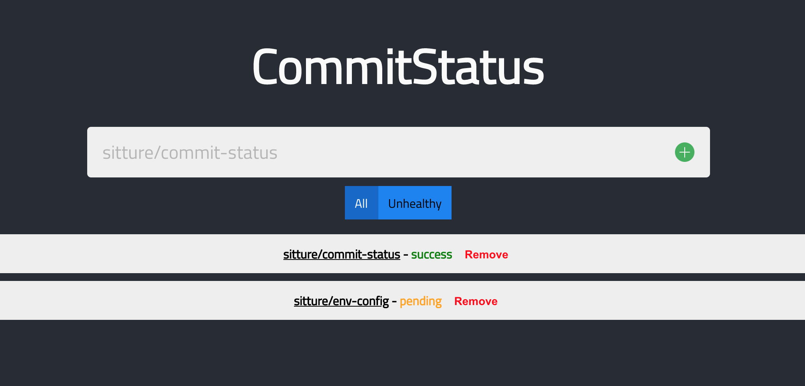

# commit-status

[](https://circleci.com/gh/sitture/commit-status)

A React based simple app that shows a list of projects with their Github commit status and use it as a dashboard to view status of your CI pipelines.

*This project was bootstrapped with [Create React App](https://github.com/facebook/create-react-app).*

>**Example app**: https://sitture.github.io/commit-status/



## Running Locally

- Make sure you have created a test app https://docs.github.com/en/apps/oauth-apps/building-oauth-apps/creating-an-oauth-app with Authorization callback URL set to `http://localhost:3000/login`

```sh
# Run the proxy server locally for github authentication
node server/index.js
# Run the application
yarn install
yarn start
```

Proxy server should now be running at `http://localhost:4000` and commit-status app running at `http://localhost:3000`.

### Lint & Tests

```sh
yarn lint
yarn test
```

## :wave: Issues & Contributions

Please [open an issue here](../../issues) on GitHub if you have a problem, suggestion, or other comments.

Pull requests are welcome and encouraged! Any contributions should include new or updated tests as necessary to maintain thorough test coverage.

## :scroll: License

This work is licensed under a [__MIT__](https://mit-license.org/) License.
